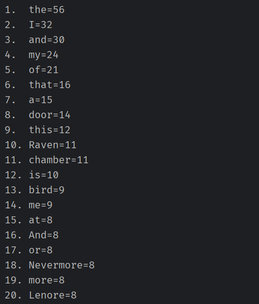

1. Read text from the webpage and store in a string variable
2. Remove all text before the `<h1></h1>` using regex inside a replaceFirst()
3. Remove the text after `<!--end chapter-->`
    - Split the string
    - Delete second item in the array
4. Using Regex strip all html tags
5. Split all the words
6. Store the key-value pairs using the word as the key and the value would be the frequency of its use.
7. Store the key-value pair based from most frequent to less frequent.
8. Print out the top Twenty Words

>The following is a write-up about my plan and shows some of my thought process during and after development.

As part of the process I look at the live poem in the site. While seeing what the assignment required I looked for things I can use to separate the poem from the rest of the site. The easy part was setting up the BufferedReader to read the output of the html from the URL. Initial assumptions I made changed after I saw the printed string from the buffered reader.

My original plan was to use "The Raven" as my target for the split. I, however, came to the realization that doing so had to major problems:
1. The title would be removed upon wouldn't be included in the new string that is created.
2. Selecting the absolute value of the text would only work with pieces called "The Raven".

>After Development Edit:  
Just realized that "The Raven" is written multiple times thought the before and after the poem. That method would have not worked as I hoped any way.

After reading the outputted text I noticed I could use some html tags (h1 tag and html comment) to separate the poem 
from the rest of the text. Also realize that striping the html wouldn't be enough as I also needed to strip the html 
entities. Afterwards I would need to create an array of containing each of the words.

The part I initially found difficult was counting the frequency that each words was used. I decided to use hashmaps 
since I could use the words as a key and the value for the frequency. Sorting it was more difficult but after 
looking at some documentation I could use the Comparator to compare each value and sort it from biggest to smallest.